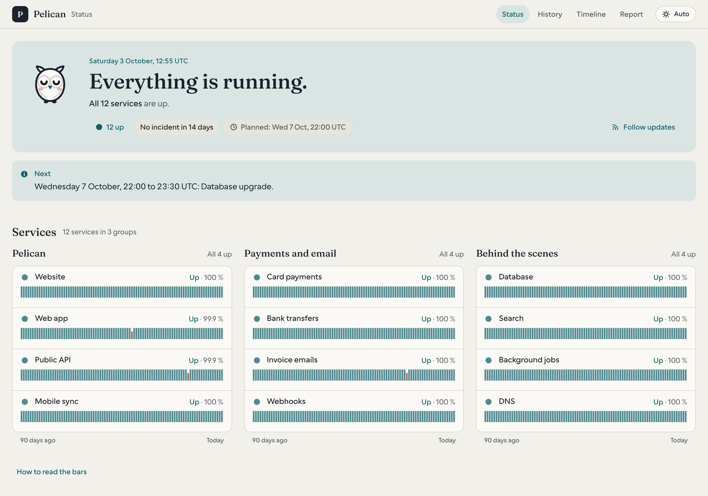

#  Hora

[](https://github.com/uplg/hora/actions/workflows/ci.yml)
[](https://github.com/uplg/hora/releases)
[](CHANGELOG.md)
[](LICENSE)

**Hora keeps the hours, so you can sleep.** A small self-hosted uptime
monitor: one Rust binary checks your services, keeps their history in
SQLite, serves a calm status page and a JSON API, and wakes you only when
something has really broken. A failed check is retried, an outage needs
several failures in a row, peers in other places confirm it, and ten
services down behind one database send one alert: the cause.

<picture>
  <source media="(prefers-color-scheme: dark)" srcset="docs/public/screenshot-dark.webp">
  
</picture>

## Install

1. **Write a config.** A minimal `hora-config/config.toml`:

   ```toml
   [page]
   title = "My services"

   [[channels]]
   name = "ops"
   type = "telegram"
   token = "${HORA_TELEGRAM_TOKEN}"
   chat_id = "123456"

   [[monitors]]
   id = "website"
   name = "Website"
   target = "https://example.com"
   interval_secs = 60
   ```

   Every option is in [`config.example.toml`](config.example.toml).
2. **Run it.**

   ```sh
   docker run -d --name hora --restart unless-stopped -p 8787:8787 \
     -e HORA_TELEGRAM_TOKEN=123:abc \
     -v "$PWD/hora-config:/etc/hora" -v hora-data:/data \
     ghcr.io/uplg/hora:latest
   ```

3. **Open <http://localhost:8787/>.** Edit the file and Hora reloads it
   live; `docker exec hora hora check` validates it and
   `docker exec hora hora test-alert` tests your channels.

History lives on the `hora-data` volume: to upgrade, pull the new image and
recreate the container, after reading [`UPGRADES.md`](UPGRADES.md). The full
guide, from peers to SLOs, is at **[uplg.github.io/hora](https://uplg.github.io/hora/)**.

## From source

```console
$ cp config.example.toml config.toml    # then edit
$ cargo run -p hora                     # the daemon, http://127.0.0.1:8787
$ cargo run -p hora -- top              # the terminal dashboard
```

Needs Rust, a C toolchain and `cmake` (for aws-lc-rs). `just gate` runs what
CI runs: fmt, clippy, cargo-deny, cargo-audit and the tests; `just deps`
reports what is behind. The docs build with `cd docs && bun install && bun run build`.

## Architecture

```
crates/hora          the binary: daemon, CLI (cli/) and the hora top TUI (top/)
crates/hora-core     config, probes, scheduler, mesh (peers), SQLite storage, reports
crates/hora-notify   the notification channels, one neutral message per event
crates/hora-web      the status page, JSON API, badges and metrics (axum + askama)
docs/                the documentation site (Astro Starlight)
brand/               the brand book, the owl, the mockups
```

## Standing on friendly shoulders

[Uptime Kuma](https://github.com/louislam/uptime-kuma),
[Gatus](https://github.com/TwiN/gatus) and
[Healthchecks](https://github.com/healthchecks/healthchecks) showed what
self-hosted monitoring can be; Hora imports Kuma backups and happily sends
its dead-man heartbeat to Healthchecks. Built on
[axum](https://github.com/tokio-rs/axum), [sqlx](https://github.com/launchbadge/sqlx),
[askama](https://github.com/askama-rs/askama),
[rustls](https://github.com/rustls/rustls) and
[hickory-dns](https://github.com/hickory-dns/hickory-dns). Same family as
Ariane and Maison, on the synthe.se design tokens.

## License

MIT. Fonts: Cal Sans, Borel, Fraunces and Mona Sans Mono (OFL 1.1, in
`crates/hora-web/assets/fonts`, licences alongside).
